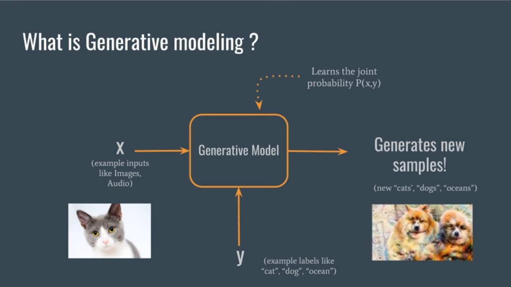
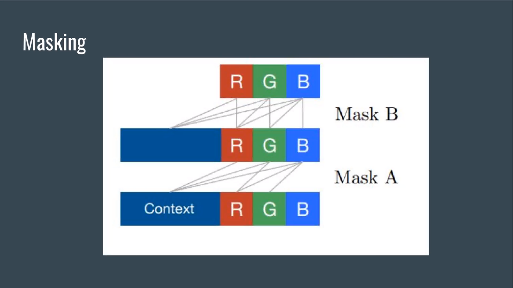

# How this things works

## Generative Modeling

    It can genarate data like sound, image etc, from the given input X and label y for this input. It learns the joint probabilty from(X,y) and make the output from there.

## Current state of Generative Modeling

    The problem is it depends on the previous pixel information to genarate new images.Which can be complex in higer dimension image and also not time efficinet.

.png>)

    In CNN it extract information independence of time, But RNN has a hidden layer that helps to genarate output and it also can pass the information to the next state,

.png>)

    In a simple RNN with sigmoid or tanh neuron units, the later output nodes of the network are less sensitive to the input at time t = 1. This happens due to the vanishing gradient problem.

[RNN overtime memory probelm](https://www.quora.com/When-should-one-decide-to-use-a-LSTM-in-a-neural-network)

    So RNN is vulnerable over time. For this probelm here we use LSTM.
    An LSTM allows the preservation of gradients. The memory cell remembers the first input as long as the forget gate is open and the input gate is closed.
    The output gate provides finer control to switch the output layer on or off without altering the cell contents. (See in the figure below the color is not fading)

.png>)

`In this paper it focus on distribution of image ROW by ROW, Pixel by Pixel to generate new image`

.png>)

Here Chanel `Green` is conditon on cheanel `red` and Chanel `Blue` is conditon on cheanel `red & Green`.

    To get the value we use masking

We also use ROW LSTM and DIAGONAL BiLSTM to get the previous pixel value.

    ROW LSTM

.png>)

    DIAGONAL BiLSTM

.png>)

As the layer goes to 12 it creates a probelm of gradient. It might become to small to allow effcient learning.

[What is gradient?](https://ml-cheatsheet.readthedocs.io/en/latest/gradient_descent.html)

While row lstm and diagonal bilstm takes time to speed up we use pixel CNN to compute features for all pixel positin at once.

.png>)

## Evuluation

    They used log likelyhood comming form a decrete distibution.
    And tehy compair them with other models which continous distribuiton by adding uniform noice to the pixel value.

.png>)
